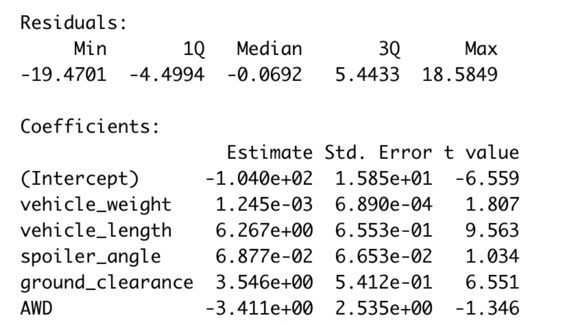
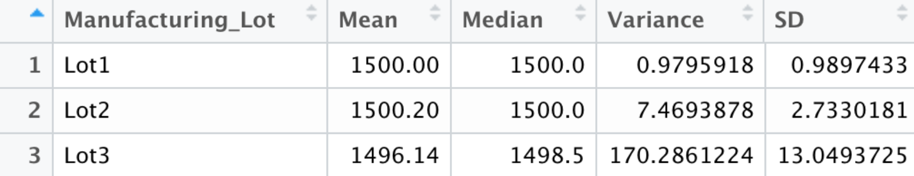

# MechaCar Statistical Analysis

## Linear Regression to Predict MPG

Which variables/coefficients provided a non-random amount of variance to the mpg values in the dataset?
* Spoiler angle, intercept, and vehicle weight

- 

- 

Is the slope of the linear model considered to be zero? Why or why not?

* No, in this linear model we would not consider the slope to be zero because our p value was shown to be 5.35^-11, meaning that it is less than the signifcant value of 0.05.

Does this linear model predict mpg of MechaCar prototypes effectively? Why or why not?

* Yes, because the factors that were represented in our model all can affect the mileage of MechaCar prototypes, thereby enabling us to safely say that this linear model prediction is for the most part accurate. 

## Summary Statistics on Suspension Coils

In our summary, the variance allowed us to note that suspension coils may not be greater than 100 lbs per inch. Therefore, the current manufacturing data meets this design specification for all manufacturing lots in total and each lot individually because of the variance.

- 

- 

## T-Tests on Suspension Coils

## Study Design: MechaCar vs Competition

In efforts of comparing MechaCar to competition, we could run tests to analyze fuel efficiency, safety, costs of maintenance, and other determining factors. 

If we were to put this in a hypothesis, our null hypothesis would be that there is no difference between MechaCar and the competition when comparing these factors and our alternate hypothesis would be that there is a difference between these factors between MechaCar and the competition. Therefore, to run this test we would need the data for fuel efficiency, safety rating, and the cost of maintenance of the vehicle.

